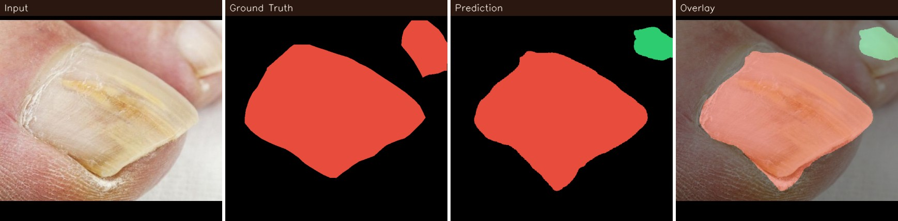
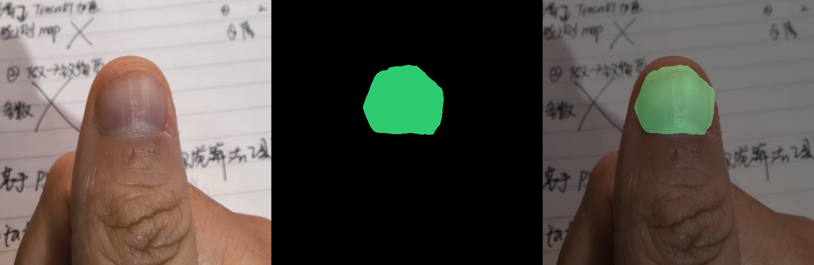
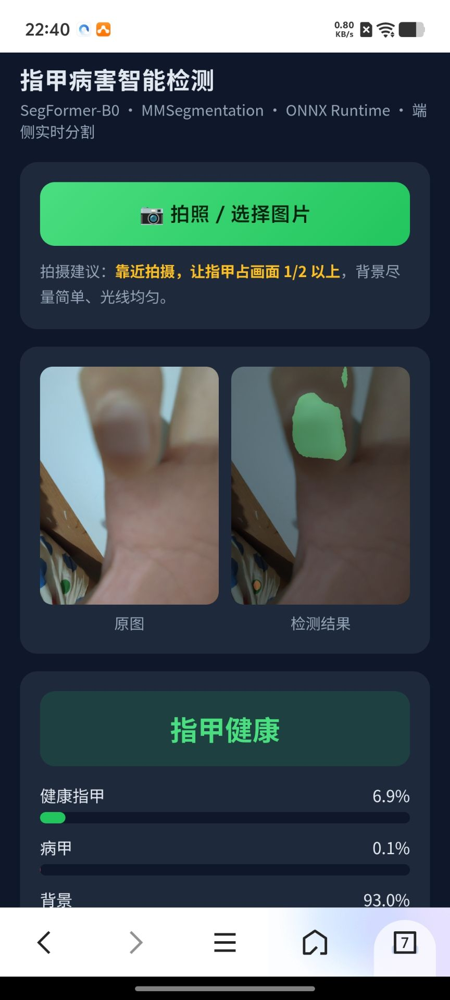

# 指甲病害语义分割与端侧部署

**Nail Disease Semantic Segmentation & On-Device Deployment**

基于 MMSegmentation 训练指甲病害语义分割模型，导出 ONNX 后部署到 AidLux（安卓），
实现"手机浏览器拍照 → 端侧实时分割 → 输出健康/病甲判定"的完整链路。



> 从左到右：输入图像 · 人工标注真值 · 模型预测 · 预测叠加



> 端侧推理三联图：原图 · 彩色预测 · 叠加



> 手机端 Web 应用（AidLux + Flask）：拍照 → 端侧分割 → 健康/病甲判定

---

## 一、项目背景与核心问题

任务：从指甲照片中识别出**病变区域**，用于初步筛查。

原始数据是**按文件夹划分的图像级标签**（healthy / onychomycosis / psoriasis），
需要转成**像素级多类别分割**任务。项目过程中解决了三个关键问题：

| 问题 | 现象 | 解决 |
|---|---|---|
| **病灶类型难分** | 甲癣与银屑病均为甲板变色/浑浊，**临床需真菌镜检才能区分**，模型在两者间严重混淆（甲癣召回仅 34%，银屑病多报 5 倍面积） | **合并为「病甲」类**，改为背景/健康/病甲 3 类 |
| **标注工具误用** | 62 张图用了 labelme 的「线段」工具沿指甲描边，直接转换只会得到 10px 描边而非填充区域 | 检测首尾间隙（中位仅 1.74px = 0.3% 周长），自动闭合并按多边形填充；真开放线段跳过并报人工复核 |
| **训练/部署不一致** | 预处理（BGR→RGB、归一化、上采样）分散在 MMSeg pipeline 里，端侧容易复刻错 | 导出 ONNX 时**把预处理与后处理内联进计算图**，端侧只需喂 RGB 图 |

---

## 二、效果

验证集 15 张，数据集级指标（累加混淆矩阵，与 MMSeg 同口径）：

| 方案 | healthy IoU | 病甲 IoU | **前景 mIoU** | mIoU(含背景) |
|---|---:|---:|---:|---:|
| 4 类（背景/健康/甲癣/银屑病） | 85.34 | 甲癣 33.61 / 银屑病 16.11 | **45.02** | 57.93 |
| **3 类（背景/健康/病甲）** | 82.36 | **87.08** | **84.72** | 88.71 |
| 3 类 + TTA | 84.40 | 86.92 | **85.66** | 89.34 |

**合并病种带来 +40.6 点的前景 mIoU 提升** —— 说明在这个任务上，**任务定义的合理性比模型调参更重要**。

其他指标：

- **ONNX 与 PyTorch 输出逐像素 100% 一致**（logits 最大偏差 1.14e-05）
- 端侧推理：512×512 输入，手机 CPU 约 **410 ms/张（2.4 FPS）**
- 训练收敛：1000 迭代约 3 分钟（单卡 A800），iter 800 达到最优

---

## 三、技术方案

```
labelme 标注 ──→ 整数掩膜 ──→ 类别合并 ──→ MMSeg 训练 ──→ ONNX 导出 ──→ 端侧 Web 应用
   (JSON)        (uint8 PNG)    (4类→3类)   SegFormer-B0   (内联前后处理)   (AidLux+Flask)
```

| 环节 | 技术选型 | 说明 |
|---|---|---|
| 标注 | labelme 7.7.0 | 自定义标签列表 + `--validate-label exact` 锁定类别名 |
| 掩膜 | 单通道 uint8 PNG | 像素值 = 类别索引；光栅化实现与 labelme 官方 `shape_to_mask` 逐行对齐并验证一致 |
| 模型 | SegFormer-B0 (MiT-B0) | 3.72M 参数，512×512 输入；ADE20K 预训练权重迁移学习 |
| 训练 | MMSegmentation 1.2.2 | CE + Dice 组合损失、强颜色抖动/旋转/遮挡增强、TTA |
| 导出 | `torch.onnx.export` | 预处理+网络+上采样+argmax 全部内联，opset 13 |
| 部署 | ONNX Runtime + AidLux + Flask | 手机浏览器调起相机 → POST 上传 → 端侧推理 → 返回结果 |

### 为什么用 Flask + Web 而不用原生 App

1. HTML 的 `<input type="file" capture="environment">` 在安卓浏览器里**可直接调起相机**，
   绕开了 AidLux 摄像头 API 的版本兼容问题；
2. 手机/电脑浏览器均可访问，便于演示与截图；
3. 单文件、零额外依赖，部署只需要 `python nail_app.py`。

---

## 四、快速开始

### 4.1 下载模型与数据

> 仓库只含代码。模型权重与数据集请从百度网盘下载（合并为一个压缩包）：

- **文件**：`网盘上传_模型与数据集.zip`
- **链接**：https://pan.baidu.com/s/1n388KxjevVdHABW80CS1hg?pwd=resj
- **提取码**：`resj`

压缩包内容：

| 路径 | 说明 |
|---|---|
| `model/nail_3class_512.onnx` | 训练好的 ONNX 模型（约 15MB，内联前后处理） |
| `model/best_mIoU_iter_800.pth` | PyTorch 训练权重（约 15MB，iter 800 最优） |
| `dataset/images/{train,val}/...` | 165 张原始图像 + labelme JSON 标注（train 150 / val 15） |
| `dataset/masks3/{train,val}/...` | 3 类整数掩膜（uint8 PNG，像素值 = 类别索引） |
| `configs/segformer-b0_nail_3class_512.py` | 训练配置备份 |
| `README_下载说明.txt` | 数据使用说明 |

### 4.2 运行手机端应用（AidLux）

```bash
# 依赖
pip install onnxruntime==1.19.2 flask==3.0.3 opencv-python

# 把 nail_3class_512.onnx 和 tools/nail_app.py 放在同一目录
python nail_app.py
# 手机浏览器打开 http://127.0.0.1:5000
```

页面上点击「📷 拍照 / 选择图片」即调起相机，约 0.4 秒后显示分割结果与判定。

> **拍摄建议**：靠近拍摄，让指甲占画面 **1/2 以上**。模型训练数据是近距特写，
> 远距离生活照（指甲仅占画面 8%）会因域偏移而失效——这一点在下面的「已知限制」中详述。

### 4.3 命令行推理

```bash
# 单张/批量推理，输出 原图|彩色预测|叠加 三联图
python tools/onnx_infer.py --model nail_3class_512.onnx --out-dir vis 照片.jpg

# 有 GT 掩膜时顺带算 IoU
python tools/onnx_infer.py --model nail_3class_512.onnx --out-dir vis \
    --masks-root data/masks3 "data/images/val/*/*.jpg"
```

### 4.4 重新训练

先从网盘下载数据集，解压到仓库根目录的 `data/` 下（与配置里的 `data_root = 'data'` 对应）：

```
nail-segmentation/
└── data/
    ├── images/{train,val}/{healthy,onychomycosis,psoriasis}/
    └── masks3/{train,val}/{healthy,onychomycosis,psoriasis}/
```

```bash
# 训练环境
pip install -r requirements-train.txt

# 训练（3 类配置）
python <mmseg>/tools/train.py configs/segformer-b0_nail_3class_512.py \
    --work-dir work_dirs/nail_3class

# 导出 ONNX（自动做数值一致性验证）
python tools/export_onnx.py \
    --config configs/segformer-b0_nail_3class_512.py \
    --checkpoint work_dirs/nail_3class/best_mIoU_iter_800.pth \
    --out deploy/nail_3class_512.onnx \
    --verify-images data/images/val --bench 30
```

---

## 五、项目结构

```
nail-segmentation/
├── configs/
│   ├── segformer-b0_nail_3class_512.py   # 3 类训练配置（MMSeg 1.x）
│   ├── class_map.json                     # 类别/调色板/中文别名（唯一真值来源）
│   └── labels.txt                         # labelme 标签列表
├── tools/
│   ├── prepare_labeling.py    # 整理数据、EXIF 摆正、去重、生成 split
│   ├── launch_labelme.sh      # 启动 labelme（含 libxcb 依赖修复）
│   ├── labelme2mask.py        # JSON → 整数掩膜（支持线段自动闭合）
│   ├── check_masks.py         # 掩膜质检 + 三联图抽查
│   ├── verify_vs_labelme.py   # 与 labelme 官方实现逐像素比对
│   ├── selftest_pipeline.py   # 端到端自测（24 项断言）
│   ├── mask2color.py          # 整数掩膜 → 可视化彩色图
│   ├── merge_classes.py       # 4 类掩膜 → 3 类（非破坏性）
│   ├── export_onnx.py         # 导出 ONNX（内联预处理 + 数值验证）
│   ├── onnx_infer.py          # ONNX 推理参考实现
│   ├── nail_app.py            # 手机端 Web 应用（Flask 单文件）
│   └── aidlux_camera.py       # AidLux 摄像头实时脚本
├── assets/
│   └── demo_prediction.jpg
├── requirements.txt           # 推理/部署依赖
├── requirements-train.txt     # 训练依赖
└── docs/
    └── PROJECT_NOTES.md       # 完整开发记录与踩坑
```

---

## 六、已知限制

1. **域偏移（最重要）**：训练数据全部为**近距特写**（指甲占画面 50~80%）。
   对远距离生活照（指甲仅占 8%，含键盘/鼠标等背景），模型会把桌面物品误判为病甲。
   - **应对**：App 中引导用户靠近拍摄（指甲占画面 ≥ 1/2）
   - **根治**：补充真实场景（远中距离、复杂背景）的标注数据，或增加「指甲检测」前置步骤

2. **验证集偏小**：仅 15 张，单张误差即造成 6.7% 的指标波动，上述指标存在 ±5~8 点的置信区间。

3. **推理速度**：512×512 输入在手机 CPU 上约 2.4 FPS，适合"拍照识别"而非实时视频流。
   如需实时，可通过 int8 量化（约 2~3×）或改用 STDC-Seg / DDRNet-18 等轻量模型。

4. **医学免责**：本模型仅作初步筛查参考，**不能替代临床诊断**。甲癣与银屑病的鉴别
   需要真菌镜检等专业手段。

---

## 七、开发过程中解决的环境问题（备查）

| 问题 | 原因 | 解决 |
|---|---|---|
| labelme GUI 起不来 | PySide6 ≥6.5 需要 `libxcb-cursor0`，Ubuntu 20.04 缺失 | 无 root 就地解包 `.deb` + `LD_LIBRARY_PATH` |
| `CustomDataset` 不在注册表 | **MMSeg 1.x 已移除该类**，功能并入 `BaseSegDataset` | 改用 `BaseSegDataset` + `data_prefix` |
| `SegLocalVisualizer` 未注册 | `mmseg.utils.tokenizer` 无条件 import `ftfy`/`regex`，而两者未声明为依赖 | 手工安装 + `custom_imports` 显式导入 |
| NumPy ABI 崩溃 | torch 2.1.2 / mmcv 2.1.0 是 NumPy 1.x 编译的 | 锁定 `numpy==1.26.4` + `opencv-python==4.9` |
| ONNX 导出报 `aten::unflatten` 不支持 | SegFormer 空间缩减注意力用到该算子 | opset 从 11 改为 **13** |
| AidLux 摄像头打不开 | 新版 `cvs` 模块已改为 GUI 框架，`VideoCapture` API 移除 | 改用浏览器 `<input capture>` 调起相机 |

---

## License

代码部分采用 [MIT License](LICENSE)。

数据集来源于公开医学图像，仅用于学术研究，请勿用于商业用途或临床诊断。
